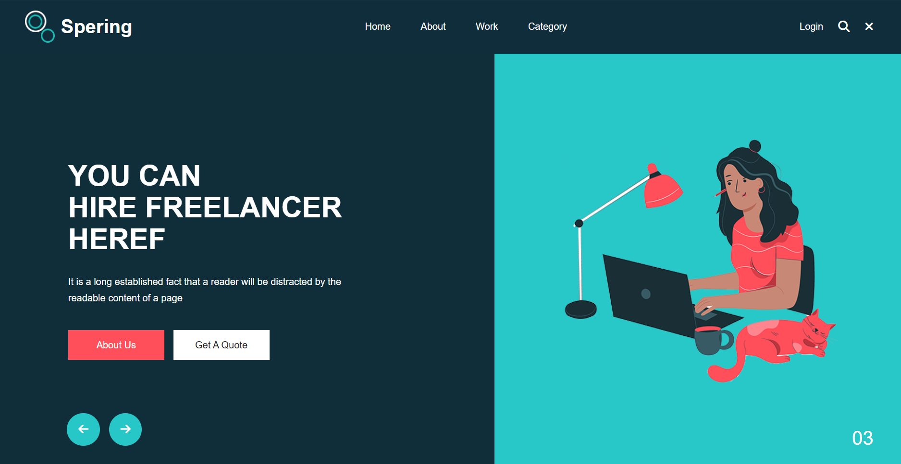
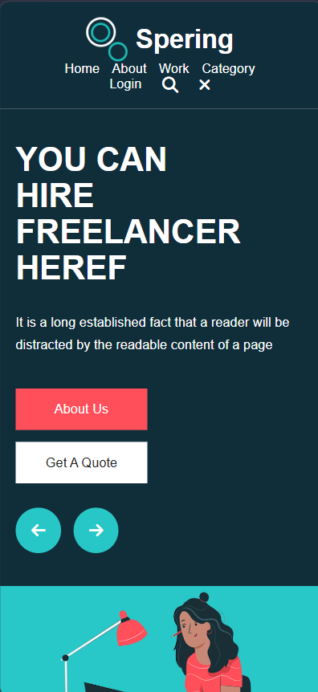

# Spering Frontend Clone

My first frontend web development project inspired by the Spering freelancer website. Built entirely with HTML5 and CSS3, focusing on responsive design, Flexbox, CSS Grid, and modern webpage layout techniques. The project is optimized for mobile, tablet, and desktop devices.

## 📸 Project Preview

### Desktop View

### Mobile View

## 🎥 Demo Videos

- [Desktop Demo](./laptop.mp4)
- [Mobile Demo](./iphone12pro.mp4)

## 🚀 Features

* Responsive Design
* Mobile, Tablet, and Desktop Support
* Modern UI Layout
* Navigation Bar
* Hero Section
* Freelancer Section
* Category Section
* About Section
* Experience Section
* Testimonial Section
* Footer Section
* Font Awesome Icons

## 🛠️ Technologies Used

* HTML5
* CSS3
* Flexbox
* CSS Grid
* Media Queries
* Responsive Web Design
* Font Awesome

## 📚 What I Learned

Through this project, I learned:

* Creating complete webpage layouts using HTML5
* Building responsive websites with CSS3
* Using Flexbox for alignment and positioning
* Using CSS Grid for structured layouts
* Implementing Media Queries for different screen sizes
* Organizing code into reusable sections
* Working with images, icons, and typography
* Understanding responsive design principles
* Using GitHub to showcase projects

## 📱 Responsive Design

The website is fully responsive and optimized for:

* Mobile Devices
* Tablets
* Laptops
* Desktop Screens

## 🎯 Challenges Faced

* Creating responsive layouts
* Aligning content correctly
* Managing different screen sizes
* Working with Flexbox and CSS Grid
* Building a complete webpage from scratch

## 🔮 Future Improvements

* Add JavaScript functionality
* Add animations and transitions
* Create a mobile navigation menu
* Add contact form validation
* Build dynamic features using Django

## 👨‍💻 Author

**Abhijith S M**

Frontend Developer | Learning Web Development

## ⭐ Project Status

Completed ✅

This project marks the beginning of my frontend development journey and helped me strengthen my understanding of modern web development fundamentals.
